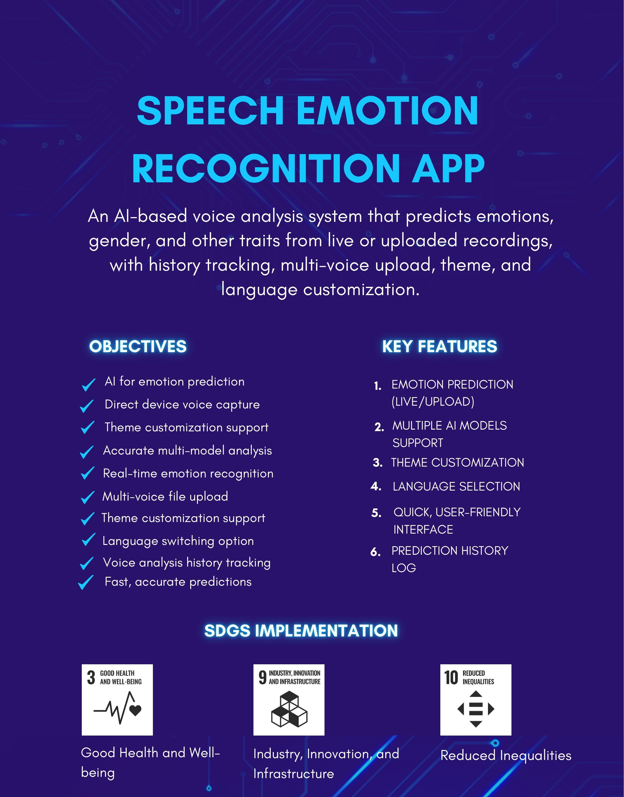

# Fatima Ali — Personal Data Science Document

---

## About Me

My name is **Fatima Ali**, and I am a student of **MS Data Science** at the **University of the Punjab (PU)**. I completed my **BSCS** at COMSATS University Islamabad, Sahiwal Campus. Originally from Khanpur, now living in Johar Town, Lahore.

My interests include *Machine Learning, Artificial Intelligence,* and *Web Development*, and I am currently learning to use tools like `Python`, `Pandas`, and `NumPy` to analyze data. I previously interned at **Dev Learn Dynamics** as a front-end developer, working with `React JS`, `Node.js`, and `MongoDB`. I am pursuing this MS to move deeper into AI/ML and build practical, data-driven solutions to real-world problems. My long-term goal is to become a **Machine Learning Engineer**.

---

## My Technology Skills

| Technology  | My Level     | Experience | I Use It For              |
|-------------|--------------|------------|----------------------------|
| Python      | Beginner    | New (started in MS) | Learning data analysis for MS coursework |
| Pandas      | [Beginner]   | [new]      | [Data cleaning and analysis] |
| NumPy       | [Beginner]   | [new]      | [Numerical computation] |
| React JS    | Intermediate | 1+ year    | Building front-end UI at my internship |
| Node.js / Express JS | Intermediate | 1+ year | Backend APIs for full-stack projects |
| MongoDB     | Intermediate | 1+ year    | Storing data for full-stack apps |
| HTML/CSS/JavaScript | Intermediate | 2+ years | Web page structure and interactivity |
| Git/GitHub  | Beginner-Intermediate | Used it before, restarted this semester with a new account | Version control for assignments and projects |

---

## My Learning Journey

1. Started my BSCS degree at COMSATS University Islamabad, Sahiwal Campus
2. Learned core web technologies: HTML, CSS, and JavaScript
3. Learned React JS and built my first front-end interfaces
4. Learned Node.js, Express JS, and MongoDB for full-stack development
5. Built full-stack projects like *Staybnb* and *Speech Emotion Recognition*
6. Started an internship at Dev Learn Dynamics as a front-end developer
7. Got admission into **MS Data Science at University of the Punjab**
8. Started learning Python data science tools (Pandas, NumPy) and Markdown for coursework

### Nested List — My Learning Areas

- Web Development
  - React JS
  - Node.js / Express JS
  - MongoDB
- Data Science
  - Python
  - NumPy
  - Pandas
- Machine Learning / AI
  - Recommendation systems

---

## My Favorite Technologies

### 1. React JS
I like React JS because it powers the entire frontend of my Final Year Project, **StayBnB** — an AI-powered real estate platform where users can search, filter, and book properties. Its component-based structure made it easy to build separate, reusable dashboards for users and admins.
Resource: [React Official Docs](https://react.dev)

### 2. Node.js
I like Node.js because I used it with Express.js to build the entire application layer of StayBnB — handling business logic, APIs, and secure communication between the frontend and the database.
Resource: [Node.js Documentation](https://nodejs.org/en/docs)

### 3. MongoDB
I like MongoDB because it formed the data layer of StayBnB, storing property listings, user accounts, and bookings. Its flexible schema made it easy to handle varied property data without rigid table structures.
Resource: [MongoDB Documentation](https://www.mongodb.com/docs)

### 4. Python
I'm new to Python, but I like it because it's central to everything I'll be doing in my MS Data Science coursework — from data analysis to eventually building ML models.
Resource: [Python Official Website](https://www.python.org)

### 5. Firebase
I like Firebase because I used it during my internship at Dev Learn Dynamics alongside Android Studio, where it made handling authentication and real-time data storage for mobile app features much easier without setting up a separate backend.
Resource: [Firebase Documentation](https://firebase.google.com/docs)

---

## Project Checklist

~~Originally planned to start a brand-new project from scratch~~ — Speech Emotion Recognition project.

- [x] Selected project topic — **Speech Emotion Recognition app with deeper data science analysis**
- [x] Found dataset *(reusing the voice/audio dataset for Speech Emotion Recognition project)*
- [ ] Downloaded dataset
- [ ] Cleaned dataset
- [ ] Performed exploratory data analysis
- [ ] Built initial model
- [ ] Wrote final report

*Update these checkboxes as you make progress through the semester.*

---

## Mathematical Expressions

**Mean**

`Mean = Σx / n`

**Accuracy**

`Accuracy = (TP + TN) / (TP + TN + FP + FN)`

---

## Quotations

> "The world is one big data problem." — *Andrew McAfee*

> "Without data, you're just another person with an opinion." — *W. Edwards Deming*

---

## Image

---

## Markdown Features I Practiced

- [x] Headings
- [x] Bold
- [x] Italic
- [ ] Strikethrough
- [x] Ordered List
- [x] Unordered List
- [x] Nested List
- [x] Links
- [x] Images
- [x] Tables
- [x] Blockquotes
- [x] Mathematical Expressions
- [x] Horizontal Rule
- [x] Inline Code

---
